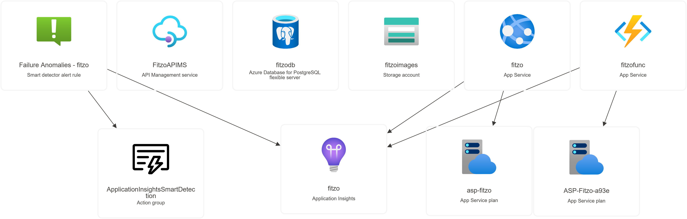
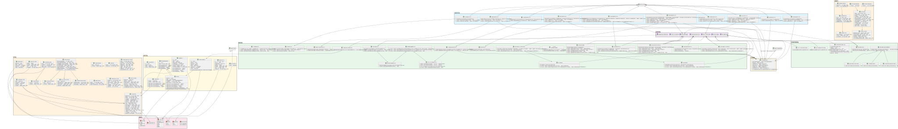

# Dokumentacja Projektu Fitzo

## 1. Wstęp
Fitzo to aplikacja mobilna i system backendowy służący do śledzenia posiłków, monitorowania spożytych kalorii oraz zarządzania celami dietetycznymi.
System składa się z centralnego API oraz aplikacji mobilnej stworzonej w technologii React Native.
Podczas tworzenia oprogramowania korzystamy z kontenerowego środowiska testowego, co zapewnia spójność konfiguracji między programistami.

## 2. Środowisko Deweloperskie (Docker Compose)
W celu zapewnienia spójnego środowiska deweloperskiego wykorzystujemy Docker Compose.
Pozwala on na szybkie uruchomienie infrastruktury lokalnej bez instalowania usług bezpośrednio na systemie operacyjnym.

### Uruchomienie infrastruktury:
`docker-compose up -d`

### Dostępne usługi:
| Usługa | URL / Host | Poświadczenia | Opis |
| :--- | :--- | :--- | :--- |
| PostgreSQL | localhost:5432 | User: fitzouser, Pass: fitzopassword, DB: fitzo_db | Główna baza danych API. |
| PgAdmin 4 | http://localhost:5050 | Email: admin@fitzo.com, Pass: admin | Interfejs graficzny do zarządzania bazą. |
| Azurite | localhost:10000 | String: UseDevelopmentStorage=true | Emulator Azure Blob Storage dla zdjęć. |

Do sprawdzenia zawartości Storage Account wymagana jest wtyczka Azure Storage Explorer lub dedykowane rozszerzenie w IDE.

## 3. Instrukcja Uruchomienia (How to Run)

### Backend:
1. Sklonuj repozytorium.
2. Uruchom infrastrukturę poleceniem `docker-compose up -d`.
3. Otwórz solucję w Visual Studio.
4. Uruchom projekt Fitzo.API.

### Frontend:
1. Przejdź do katalogu `Fitzo.Mobile`.
2. Zainstaluj zależności (`npm install`).
3. Zainstaluj Expo Go na urządzeniu mobilnym.
4. Otwórz aplikację (Ważne: należy zmienić adres w `ApiClient` na adres IP Twojego komputera).

## 4. Infrastruktura i Pipeline CI/CD
Wykorzystujemy GitHub Actions do automatyzacji procesu wdrażania zmian na serwer w chmurze Azure.
* **Plik workflow:** `.github/workflows/backend-pipeline.yml`
* **Wyzwalacze:** Push do gałęzi main, Pull Requests.
* **Kroki procesu:**
    1.  **Build & Test:** Kompilacja solucji .NET i uruchomienie testów jednostkowych oraz integracyjnych.
    2.  **Quality Gate:** Analiza kodu w SonarCloud (statyczna analiza kodu).
    3.  **Security Scan:** Skanowanie obrazu Docker pod kątem podatności przy użyciu narzędzia Trivy.
    4.  **Publish:** Przesłanie obrazu Docker do GitHub Container Registry (GHCR).
    5.  **Deploy:** Automatyczne wdrożenie API do usługi Azure App Service.

## 5. Infrastruktura w chmurze Azure

Nasze rozwiązanie w pełni wykorzystuje ekosystem Microsoft Azure, co zapewnia wysoką skalowalność, bezpieczeństwo oraz separację odpowiedzialności między poszczególnymi modułami systemu.

### Wykorzystane usługi Azure:

* **Azure Database for PostgreSQL:** W pełni zarządzana baza danych, w której przechowywane są wszystkie dane relacyjne aplikacji, w tym profile użytkowników, dzienniki żywieniowe oraz dane produktów.
* **Azure Storage Account:** Wykorzystywany jako magazyn typu Blob Storage do bezpiecznego i wydajnego przechowywania plików binarnych, takich jak zdjęcia potraw oraz awatary użytkowników.
* **Azure Functions:** Architektura bezserwerowa (serverless) odpowiedzialna za asynchroniczne przetwarzanie zdjęć (np. optymalizację rozmiaru lub generowanie miniatur) po ich przesłaniu do magazynu danych.
* **Azure App Service (Web App):** Hostuje nasze główne API (.NET). Zapewnia automatyczne skalowanie oraz integrację z potokami CI/CD.
* **Azure API Management (APIM):** Pełni rolę API Gateway. Jest to jedyny punkt wejścia dla aplikacji mobilnej, co pozwala na ukrycie bezpośredniej architektury serwera, zarządzanie limitami żądań (rate limiting) oraz centralizację polityk bezpieczeństwa i autoryzacji.

## 6. Diagram UML (Zaktualizowany)
 
 [Otwarcie w drugiej karcie](https://csb10032003d96addec.blob.core.windows.net/temporarydocs/uml2.svg)

## 6. Wzorce Projektowe
Logika aplikacji opiera się na 5 kluczowych wzorcach projektowych zaimplementowanych w domenie rdzennej.

### 1. Budowniczy (Builder) - Moduł tworzenia przepisów
* **Opis:** Zarządzanie złożonością tworzenia obiektu `Recipe` (obsługa składników, zdjęć, tagów i statystyk).
* **Implementacja:**
    * Wzorzec oddziela proces konstruowania obiektu od jego reprezentacji.
    * **Komponenty:**
        * `Director` (`RecipeDirector`): Kontroluje kolejność wywołań (reset, ustawienie nazwy, obrazka, tagów, dodanie składników).
        * `Builder Interface` (`IRecipeBuilder`): Definiuje metody budujące.
        * `Concrete Builder` (`StandardRecipeBuilder`): Implementuje logikę tworzenia encji `Recipe`, np. konwersję `IngredientDto` na `Ingredient`.
        * `Product` (`Recipe`): Złożony obiekt wynikowy.
    * **Działanie:** Kontroler (`RecipesController`) otrzymuje DTO, przekazuje je do Dyrektora, który krok po kroku instruuje Buildera, jak złożyć obiekt `Recipe`. Na koniec Builder zwraca gotową instancję do zapisania w bazie.

### 2. Adapter - Integracja z zewnętrznymi danymi
* **Opis:** System pobiera dane żywieniowe od zewnętrznych dostawców (OpenFoodFacts, USDA).
* **Implementacja:**
    * Wzorzec służy do ujednolicenia dostępu do API o niekompatybilnych interfejsach.
    * **Komponenty:**
        * `Target Interface` (`INutritionProvider`): Wspólny interfejs oczekiwany przez aplikację, zwracający `ProductDto`.
        * `Adapters`: `OffAdapter` (dla OpenFoodFacts) i `UsdaAdapter` (dla USDA). Tłumaczą specyficzne formaty JSON (np. `OffProduct`, `UsdaFoodItem`) na wewnętrzny model `ProductDto`.
        * `Composite` (`HybridNutritionProvider`): Łączy oba adaptery, odpytując je równolegle lub wybierając odpowiedni na podstawie formatu zapytania (np. kod kreskowy -> OFF, nazwa angielska -> USDA).
    * **Działanie:** Kontroler wywołuje metodę `Search`, nie wiedząc, skąd pochodzą dane. Adaptery wykonują zapytania HTTP i mapują wyniki.

### 3. Pełnomocnik (Proxy) - Optymalizacja i Bezpieczeństwo
* **Caching Proxy (`CachingNutritionProxy`):**
    * Przechowuje odpowiedzi z zewnętrznych API w pamięci podręcznej (`IMemoryCache`), aby skrócić czas reakcji i ograniczyć liczbę zapytań.
    * Działa jako nakładka na `HybridNutritionProvider`. Przed wykonaniem zapytania sprawdza, czy wynik istnieje w cache. Jeśli tak – zwraca go natychmiast ("Cache Hit"). Jeśli nie – pobiera z API i zapisuje na przyszłość.
* **Protection Proxy (`RecipeProtectionProxy`):**
    * Działa jako strażnik dostępu do `RecipeManager`, sprawdzając uprawnienia użytkownika przed wykonaniem operacji.
    * Dla operacji takich jak `DeleteRecipe` czy `UpdateRecipeImage`, Proxy sprawdza, czy `CurrentUserId` zgadza się z `OwnerId` przepisu. Jeśli nie – rzuca wyjątek `UnauthorizedAccessException` i nie dopuszcza do wywołania właściwej metody.

### 4. Łańcuch Odpowiedzialności (Chain of Responsibility) - Moduł walidacji
* **Opis:** Walidacja integralności przepisu przed zapisem w bazie danych.
* **Implementacja:**
    * Wzorzec pozwala przekazywać obiekt `Recipe` przez sekwencję walidatorów. Każdy walidator decyduje, czy przerwać proces (rzucając wyjątek), czy przekazać obiekt dalej.
    * **Elementy łańcucha (`RecipeValidationHandler`):**
        1.  `DataIntegrityValidator`: Sprawdza podstawowe dane (czy nazwa nie jest pusta, czy przypisano właściciela).
        2.  `ImageValidator`: Weryfikuje poprawność formatu URL zdjęcia (jeśli istnieje).
        3.  `IngredientsCountValidator`: Sprawdza limity biznesowe (min. 1 składnik, max. 50).
    * **Działanie (Fail-fast):** Jeśli którykolwiek walidator wykryje błąd, proces jest natychmiast przerywany. Jeśli walidacja przejdzie pomyślnie, obiekt trafia do bazy danych.

### 5. Strategia (Strategy) - Metryki i personalizacja
* **Opis:** Obliczanie zapotrzebowania kalorycznego (BMR) na podstawie różnych modeli matematycznych.
* **Implementacja:**
    * Wzorzec definiuje rodzinę algorytmów i umożliwia ich wymienne użycie w czasie działania aplikacji.
    * **Interfejs:** `IBmrStrategy` z metodą `CalculateBmr(UserProfile profile)`.
    * **Strategie:**
        * `MifflinStJeorStrategy`: Nowsza formuła, uwzględnia płeć, wagę, wzrost i wiek.
        * `HarrisBenedictStrategy`: Klasyczna formuła o innej charakterystyce matematycznej.
    * **Kontekst (`BmrService`):** Na podstawie wyboru użytkownika (enum `BmrFormula`) dynamicznie pobiera odpowiednią implementację strategii z kontenera DI i deleguje do niej obliczenia.

## 7. Wykorzystane Technologie i Frameworki

### Backend:
* **Entity Framework Core:** Wykorzystanie DbContext do pracy z bazą PostgreSQL (Code First).
* **ASP.NET Core Identity:** Zarządzanie użytkownikami, autoryzacja za pomocą JWT Token oraz dziedziczenie po klasie IdentityUser z wykorzystaniem typu danych Guid.
* **ASP.NET Core MVC:** Wykorzystanie ControllerBase jako fundamentu dla endpointów API.

### Testowanie:
* **Moq:** Tworzenie atrap (mocków) obiektów i baz danych do testów.
* **Fluent Assertions:** Zastosowanie biblioteki do tworzenia czytelnych i naturalnych asercji w testach jednostkowych.

### Frontend:
* **Expo Go:** Framework do łatwej implementacji i testowania aplikacji mobilnej Fitzo.Mobile.

## 8. Podział Pracy
Podział pracy oparty był o system zadań (Issues) w serwisie GitHub, oraz podział na same wzorce jak poniżej, gdzie każdy członek zespołu był odpowiedzialny za implementację wybranych wzorców oraz modułów funkcjonalnych.

* **Kamil:** [Adapter API1](https://github.com/Fitzo-Team/Fitzo/issues/12), [Adapter API2](https://github.com/Fitzo-Team/Fitzo/issues/19)
* **Wojtek:** [Builder](https://github.com/Fitzo-Team/Fitzo/issues/10), [Chain of Responsibility](https://github.com/Fitzo-Team/Fitzo/issues/14)
* **Błażej:** [Caching Proxy and Auth Proxy](https://github.com/Fitzo-Team/Fitzo/issues/13), [BMR Strategy](https://github.com/Fitzo-Team/Fitzo/issues/11), [Auth](https://github.com/Fitzo-Team/Fitzo/issues/9)
* **Całość Zadań** [Całość wszystkich Issues dla wszystkich](https://github.com/Fitzo-Team/Fitzo/issues?q=is%3Aissue%20state%3Aclosed).